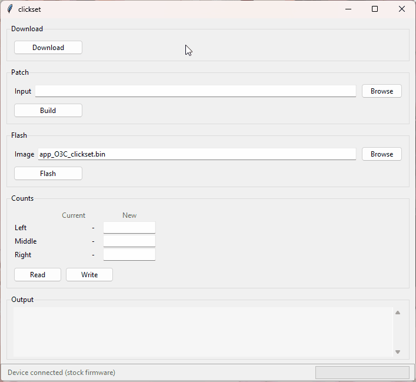

# o3c-clickset

<p align="center">
  
</p>

Patches SayoDevice O3C firmware 1.4.12 to add a click-counter command, then reads and sets the device's all-time key press counts over USB HID.

> [!CAUTION]
> This flashes custom firmware and writes directly to your device over USB HID. It only works on SayoDevice O3C firmware 1.4.12, and writing counts is irreversible. Back up your factory counts before modifying and use at your own risk!

## Install

```sh
python -m venv .venv
.venv\Scripts\activate
pip install -r requirements.txt
```

## Usage

### GUI

```sh
.venv\Scripts\python.exe gui.py
```
or (equivalent)

```sh
run.bat
```

Then, in the window:

1. Click *Download* to fetch the stock firmware (`app_O3C.bin`).
2. In *Patch*, pick `app_O3c.bin` and press *Build* to produce the patched `app_O3C_clickset.bin`.
3. Put the device in bootloader mode (hold the knob 2-3s -> Device -> Factory Recovery -> Jump to bootloader), then click *Flash* and confirm. Do not unplug while o3cpatch runs.
4. Once the patched firmware is on the device, in *Counts* click *Read* to show the current values, type the new counts, and click *Write* to write the values.
5. Optionally, flash back the stock 1.4.12 on [sayodevice.com](https://sayodevice.com).

### CLI

```sh
python download_firmware.py
python patch_firmware.py app_O3C.bin
python flash_firmware.py app_O3C_clickset.bin
python set_counts.py read
python set_counts.py set --left n --middle n --right n
```

## Architecture

- The firmware is decrypted and has the custom read and write operations spliced in, the integrity checksum is fixed and the firmware is re-encrypted before being flashed onto the device. The app sends a custom request to interact with the new read and write commands to modify the key press counts stored in the device's memory.
- [IDA Pro](https://hex-rays.com/ida-pro) 9.3 was used to analyze the binary and obtain the necessary information to create the patcher.

## FAQ

**Can this brick or destroy my SayoDevice?**

No, it's virtually impossible. The flashing utility and this application never touch the bootloader. If anything goes wrong, you can easily reflash stock firmware at [sayodevice.com](https://sayodevice.com).

**Will my settings change or get overridden?**

No. Your settings (actuation, lighting, etc) are not affected by the firmware flashing.

**Is the binary patching version independent?**

No. The patch targets a specific firmware version. The downloader always fetches the latest version, which as of now is 1.4.12. If the latest version ever changes, this project is broken until it's updated and the patching utility will fail.

**Are these changes permanent?**

Yes. Once the custom firmware is flashed and a count is written over HID, it is irreversible. If you want to keep your factory counts, store them somewhere before modifying and write them back afterward. You can safely overwrite the firmware later by reflashing the latest version on [sayodevice.com](https://sayodevice.com); the counts persist.

**Why isn't it working?**

The most common issues are:

- Python isn't installed.
  - Download the [latest version of Python](https://www.python.org/downloads/).
- Your Sayodevice O3C is not plugged in.
- You're not displaying lifetime counts on your device.
  - Hold the knob, go to *Display* -> *Main screen*, and set *Key count* to *all*, which shows lifetime presses.
- You're device is not on firmware version 1.4.12.
- This project is out of date.

## Attribution

- [o3cpatch](https://github.com/Vali0004/o3cpatch)
  - Flashing wraps its `upgrade.exe`. o3cpatch is automatically downloaded to flash the image.

## License

[MIT](LICENSE.md)